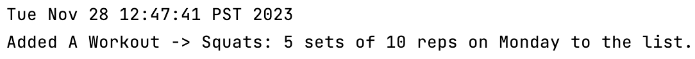
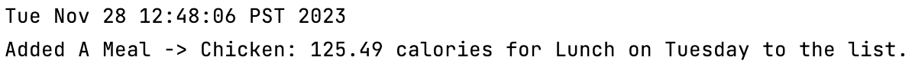
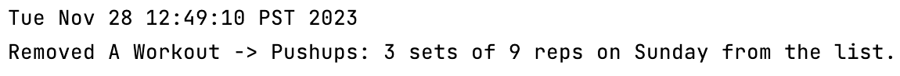
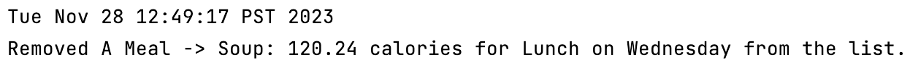
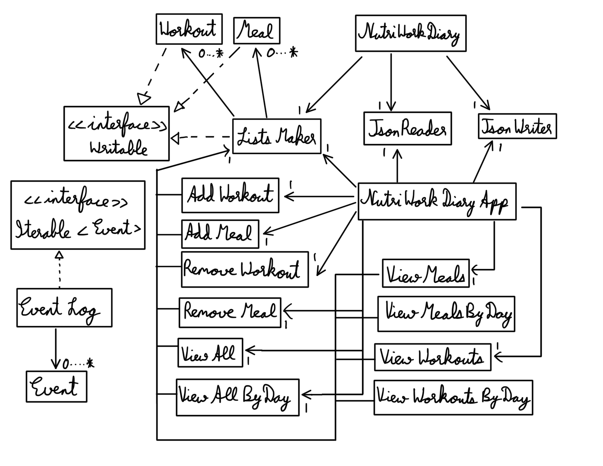

# My Personal Project

## 
 <u> NutriWork Diary </u> 

##### 
 *Weekly Fitness and Nutrition Managing System*

The aim of this application is that is serves as a system that the users can use to make their own workout and meals
routine that they want to follow for a better living. This system allows the users to input the workout and meals
details that they want to follow. The users can view the workouts and meals that are categorized accordingly and also
categorized by the days in a week.

The application will primarily be used by:

- **Users who want to keep a daily workout routine that they want to follow for being healthy.**
- **Professional gym trainers who want to give their clients a workout routine that they can follow.**
- **Users who want to keep a track of their daily meals.**
- **Users who are planning to follow a workout routine and a meal plan.**

As someone who cares about staying fit and healthy, I know how tough it can be to manage what we eat and our workouts.
NutriWork Diary brings together my personal interests and my technical skills, making it easy for anyone to keep manage
their meal and workout routines.

## User Stories

- As a user, I want to be able to add workout details.
- As a user, I want to be able to view my workout routine.
- As a user, I want to be able to sort my workouts with the days in a week.
- As a user, I want to be able to delete a workouts from the list of workouts.
- As a user, I want to be able to clear all my workouts from the list.
- As a user, I want to be able to add meal details.
- As a user, I want to be able to view my meal plan.
- As a user, I want to be able to sort my meal plan by the days in a week.
- As a user, I want to be able to delete a meal from the list of meals.
- As a user, I want to be able to delete all my meals from the list.
- As a user, I want to be able to view both workouts and meals together.
- As a user, I want to be able to view both workouts and meals together that are sorted by the days in a week.
- As a user, I want to be able to save both workouts and meals while using the application for future use.
- As a user, I want to be able to load both the workouts and meals data when I reopen the application.

## Instructions for Grader

- You can add multiple Workouts by clicking on Add Button on the main window and choosing Workout from the dialog box
- You can add multiple Meals by clicking on Add Button on the main window and choosing Meal from the dialog box
- You can remove multiple Workouts by clicking on Remove Button on the main window and choosing Workout from the dialog
  box
- You can remove multiple Meals by clicking on Remove Button on the main window and choosing Meal from the dialog box
- You can view all Workouts at once by clicking on View Button on the main window and then choosing Workout from the
  dialog box
- You can view all Meals at once by clicking on View Button on the main window and then choosing Meal from the dialog
  box
- You can view both Meals and Workouts side-by-side by clicking on View All Button on the main window
- You can view both Meals and Workouts By Day side-by-side by clicking on View All By Day Button on the main window
- You can load both Meals and Workouts at once by clicking on Load Button on the main window
- You can save both Meals and Workouts at once by clicking on Save Button on the main window
- You can quit the application by clicking on the Quit Button on the main window

## Phase 4: Task 2

- When the user adds a new Workout to the list, an Event gets added to the EventLog
  and prints out onto the console after quitting the application.
    - For Example, adding a new Workout with the details (Name: Squats, Sets: 5, Reps: 10, Day: Monday)
      prints a new Event onto the console that looks like this:
      

- When the user adds a new Meal to the list, an Event gets added to the EventLog
  and prints out onto the console after quitting the application.
    - For Example, adding a new Meal with the details (Name: Chicken, Calories: 125.49, Meal Time: Lunch, Day: Tuesday)
      prints a new Event onto the console that looks like this:
      

- When the user removes an existing Workout from the list, an Event gets added to the EventLog
  and prints out onto the console after quitting the application.
    - For Example, removing an existing Workout with the details (Name: Pushups, Sets: 3, Reps: 9, Day: Sunday)
      prints a new Event onto the console that looks like this:
      

- When the user removes an existing Meal from the list, an Event gets added to the EventLog
  and prints out onto the console after quitting the application.
    - For Example, removing an existing Meal with the details (Name: Soup, Calories: 120.24, Meal Time: Lunch, Day:
      Wednesday) prints a new Event onto the console that looks like this:
      

      

## Phase 4: Task 3

- I would do refactoring between ViewAll and ViewAllByDay, ViewMeals and ViewMealsByDay, and ViewWorkouts and 
ViewWorkoutsByDay because these classes are pretty similar as the main differences are just adding the day. 
Maybe I will extend the ViewAllByDay Class from the ViewAll Class and override some methods to make the ViewAllByDay 
Class with fewer lines of code. 
- I would also create a new Class with some methods for the Visual content because I was resizing the images everytime.
So making a new Class and just calling the methods would make it easier to understand with fewer lines of code.